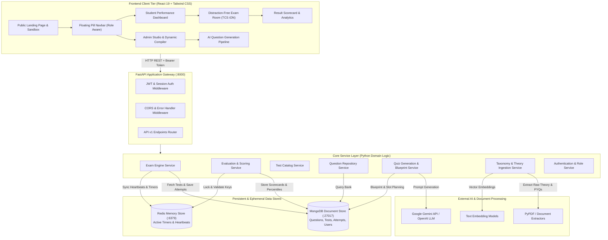
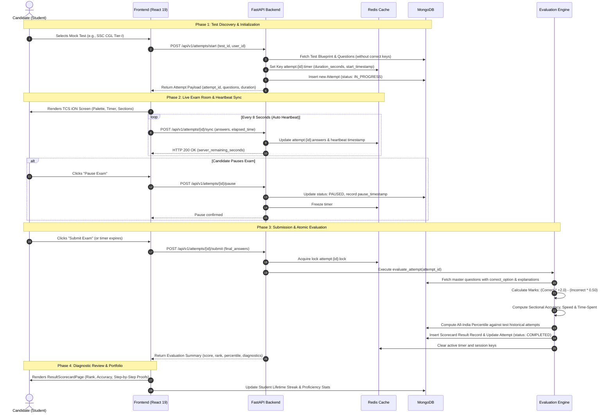
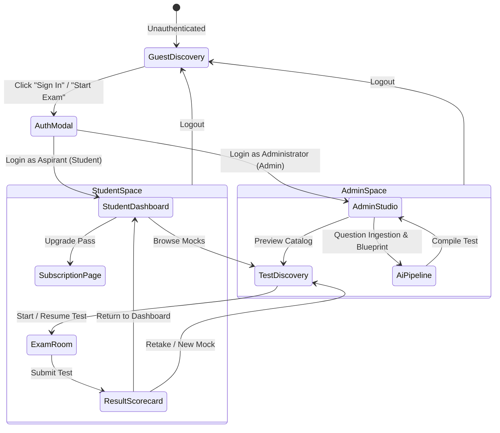

# GovExam Pro — Complete Architectural Blueprint & Data Flow Specification

> **Official System Documentation**  
> *A high-trust, institutional-grade mock examination and diagnostic analytics platform calibrated for Indian competitive examinations (SSC CGL, Banking IBPS/SBI PO, Railways RRB NTPC, and State PSCs).*

---

## 1. Executive Summary & Project Purpose

### 1.1 What the Project Is
**GovExam Pro** is a full-stack, enterprise-grade assessment platform purpose-built to simulate official Indian government competitive examinations with strict 1:1 fidelity to the **TCS iON examination environment**. Unlike generic consumer test platforms that use simplified forms, lenient scoring, and cartoonish animations, GovExam Pro is engineered with **institutional rigor**:
- **Official Scoring Physics**: True positive marks (+2.00 or +1.00) and strict negative deduction rules (-0.50, -0.25, -0.33).
- **Server-Synchronized Engine**: Active countdown timers run on server clocks, backed by Redis in-memory locks to prevent client-side time manipulation or tampering.
- **TCS iON 5-State Question Palette**: Pixel-accurate navigation states (*Answered*, *Not Answered*, *Marked for Review*, *Answered & Marked for Review*, *Not Visited*).
- **Deep Topic Diagnostics**: Speed vs. accuracy tradeoff curves, time-spent distributions, and step-by-step mathematical proofs.
- **Dual-Theme Design System**: Clean, anti-AI academic aesthetics with instant pre-hydration light/dark synchronization.

### 1.2 Target Examinations Covered
| Exam Name | Conducting Body | Tier / Stage | Total Qs | Duration | Marking Scheme | Section Breakdown |
|:---|:---|:---:|:---:|:---:|:---:|:---|
| **SSC CGL** | Staff Selection Commission | Tier-I / Tier-II | 100 Qs | 60 Mins | +2.00 / -0.50 | Quant (25), Reasoning (25), English (25), GA (25) |
| **IBPS / SBI PO** | Institute of Banking Personnel | Prelims | 100 Qs | 60 Mins | +1.00 / -0.25 | English (30), Quant (35), Reasoning (35) • 20m sectional timers |
| **RRB NTPC** | Railway Recruitment Boards | CBT-1 | 100 Qs | 90 Mins | +1.00 / -0.33 | GA & Science (40), Math (30), Reasoning (30) |
| **State PSC** | UPPSC / BPSC / MPPSC | Prelims GS-I | 150 Qs | 120 Mins | +1.33 / -0.44 | Polity (30), History (30), Science (30), Geo (30), Current (30) |

---

## 2. High-Level System Architecture

The project is structured as a decoupled **Client-Server Architecture**:
- **Frontend (FE)**: React 19 Single-Page Application (SPA) powered by Vite, Tailwind CSS, and custom SVG analytics.
- **Backend (BE)**: Asynchronous FastAPI service running on Python 3.11+, implementing clean architecture with domain-driven services and repositories.
- **Data Tier**:
  - **MongoDB**: Primary document store for users, questions, taxonomies, configured tests, attempts, and evaluation scorecards.
  - **Redis**: High-speed memory store for server countdown timers, concurrent test locks, and 8-second client state sync heartbeats.
- **AI / Pipeline Tier**: Ingestion processors for PDFs, Previous Year Questions (PYQs), vector embeddings, and LLM-assisted question compilers.



---

## 3. End-to-End Data Flow & Lifecycle

The lifecycle of data in GovExam Pro spans 6 primary phases:



---

## 4. Architectural Step-by-Step Connections

### 4.1 Frontend Views & Navigation Flow



### 4.2 Frontend Components to Backend Endpoints Mapping

| Frontend View / Component | User Action | HTTP Method & Route | Backend Service Handling Request | Data Store Touched |
|:---|:---|:---|:---|:---|
| **TestDiscoveryPage** (`pages/TestDiscoveryPage.jsx`) | Load available tests | `GET /api/v1/tests` | `test_service.py` | MongoDB: `tests` |
| **TestDiscoveryPage** (`pages/TestDiscoveryPage.jsx`) | Launch test | `POST /api/v1/attempts/start` | `exam_engine_service.py` | MongoDB: `attempts`, Redis: `attempt:{id}` |
| **ExamRoomPage** (`pages/ExamRoomPage.jsx`) | 8s background sync | `POST /api/v1/attempts/{id}/sync` | `exam_engine_service.py` | Redis: `attempt:{id}:answers` |
| **ExamRoomPage** (`pages/ExamRoomPage.jsx`) | Pause test | `POST /api/v1/attempts/{id}/pause` | `exam_engine_service.py` | MongoDB: `attempts` (status: PAUSED) |
| **ExamRoomPage** (`pages/ExamRoomPage.jsx`) | Resume test | `POST /api/v1/attempts/{id}/resume` | `exam_engine_service.py` | MongoDB: `attempts` (status: IN_PROGRESS) |
| **ExamRoomPage** (`pages/ExamRoomPage.jsx`) | Submit test | `POST /api/v1/attempts/{id}/submit` | `evaluation_service.py` | MongoDB: `results`, `attempts` |
| **ResultScorecardPage** (`pages/ResultScorecardPage.jsx`) | View test analytics | `GET /api/v1/results/{attempt_id}` | `evaluation_service.py` | MongoDB: `results`, `questions` |
| **StudentDashboardPage** (`pages/StudentDashboardPage.jsx`) | Load profile & streak | `GET /api/v1/users/{id}/dashboard` | `users.py` / `test_service.py` | MongoDB: `users`, `results` |
| **AdminStudioPage** (`pages/AdminStudioPage.jsx`) | Compile auto-mock | `POST /api/v1/admin/auto-generate-mock` | `quiz_assembly_service.py` | MongoDB: `questions`, `tests` |
| **AdminStudioPage** (`pages/AdminStudioPage.jsx`) | Search questions | `GET /api/v1/questions` | `question_service.py` | MongoDB: `questions` |
| **AiPipelinePage** (`pages/AiPipelinePage.jsx`) | List taxonomy | `GET /api/v1/generation/taxonomies` | `taxonomy_service.py` | MongoDB: `taxonomies` |
| **AiPipelinePage** (`pages/AiPipelinePage.jsx`) | Generate question batch | `POST /api/v1/generation/generate-batch` | `quiz_generation_service.py` | LLM + MongoDB: `questions` |

---

## 5. Detailed Component Breakdown

### 5.1 Public Landing Page & Interactive Sandbox (`TestDiscoveryPage.jsx`)
- **Ambient Canvas**: Multi-layered background mesh (`bg-grid-pattern`, `bg-mesh-hero`) with fluid ambient glowing blobs (`animate-blob`, `animate-blob-delayed`, `animate-glow-pulse`).
- **Live Activity Ticker**: Animated pill indicator displaying real-time concurrent simulation numbers (*"1,420 Aspirants in Active Timed Simulation"*).
- **Interactive TCS iON Live Test-Drive Sandbox**: A functional mini-exam widget right in the hero where visitors can answer a Quantitative Aptitude question (*"Q14. Profit & discount..."*), see the 25-question palette update live to *Answered* (Green) or *Review* (Purple), and expand an instant mathematical proof.
- **Syllabus Blueprint Explorer**: Switchable tabs for SSC CGL, IBPS/SBI PO, RRB NTPC, and State PSC with section allocations, marks, and timing splits.
- **Target Score & AIR Percentile Predictor**: An interactive slider (80 to 195 marks) computing projected percentile, rank range, and post eligibility in real time.
- **Filterable Mock Catalog**: Full Mocks, Subject Drills, and Topic Mini Drills with difficulty badges, duration pills, and rules modals.

### 5.2 Floating Pill Navbar (`Navbar.jsx`)
- **Detached Frosted Glassmorphism**: Floats gracefully at the top of the viewport (`fixed top-4 inset-x-0 mx-auto w-[94%] max-w-5xl z-50 rounded-full backdrop-blur-md`).
- **Role-Aware Architecture**:
  - **Guest**: Mock Tests, Passes & Pricing, Sign In, Join Free.
  - **Aspirant (Student)**: Dashboard, Test Library, Passes, Active Exam Resume badge.
  - **Administrator**: Admin Studio, AI Pipeline, Test Catalog.
- **1-Click Role Simulation Switcher**: Allows toggling between *Aspirant* and *Admin* directly from the profile dropdown.
- **Theme Toggle**: Moon/Sun toggle synchronized with `ThemeContext`.

### 5.3 Distraction-Free Exam Engine (`ExamRoomPage.jsx`)
- **Top Sticky Bar**: Test title, section title, countdown timer, theme toggle, Pause button, and Submit Exam CTA.
- **TCS iON 5-State Question Palette**:
  - `ANSWERED` (Muted Green `#059669`): Question answered and recorded.
  - `NOT_ANSWERED` (Soft Crimson `#E11D48`): Question visited but left blank.
  - `MARKED_FOR_REVIEW` (Purple `#7C3AED`): Marked for later review without answer.
  - `ANSWERED_AND_MARKED_FOR_REVIEW` (Purple with Green Dot): Answered and flagged.
  - `NOT_VISITED` (Charcoal Slate `#94A3B8`): Question not yet seen.
- **Question Typography**: Academic readability with 1.6 line height and large legible font sizes.
- **Option Block Rows**: Full clickable block rows with custom radio buttons and selected elevation.
- **Pause & Resume Modal**: Secure modal pausing the server timer and hiding questions to prevent offline cheating.
- **Tab-Switch Proctoring Warning**: Detects window blur events and displays integrity notices.

### 5.4 Diagnostic Result Scorecard (`ResultScorecardPage.jsx`)
- **Scorecard Hero**: Total raw score, All-India percentile, rank, and qualifying status.
- **4 KPI Cards**: Accuracy percentage, Speed (seconds/question), Correct vs. Incorrect ratio, and Total Attempted.
- **Sectional Performance Analytics**: Pure SVG accuracy vs. time spent comparative charts across Quant, Reasoning, English, and General Awareness.
- **Question-by-Question Solution Review**: Soft red/green highlighting with collapsible concept explanation accordions containing step-by-step mathematical proofs and shortcut methods.

### 5.5 Student Performance Dashboard (`StudentDashboardPage.jsx`)
- **Aspirant Header**: Candidate roll number, target exam tag, and welcome greeting.
- **7-Day Streak Tracker**: Micro day-by-day status indicators tracking daily practice consistency.
- **Metric Cards**: Exams completed, average accuracy, upcoming mock dates, and latest percentile.
- **Test Library & History**: List of available mocks with instant launch triggers and past attempt history table with scorecards.

### 5.6 Admin Studio & Dynamic Test Compiler (`AdminStudioPage.jsx`)
- **System Health Monitor**: Live connectivity status for MongoDB, Redis, and Question Generation Engine.
- **Dynamic Auto-Mock Generator**: Configurator allowing admins to compile a new mock test on-the-fly by exam type, question count, duration, and marking scheme.
- **Question Bank Explorer**: Filterable repository search by subject, topic, and difficulty with full answer keys and explanations.

---

## 6. What We Are Providing (Feature Inventory)

### 6.1 Academic & Anti-AI Design Philosophy
- **Anti-AI Styling**: Eliminates generic dark neon purple gradients and oversized cartoon buttons. Uses crisp whites (`#FFFFFF`), ultra-light slate backgrounds (`#F8FAFC`), deep charcoal body text (`#0F172A`, `#1E293B`), and purposeful semantic functional colors.
- **Robust Light/Dark Theming**: Instant pre-hydration script in `index.html` prevents theme flashing; synchronous DOM updates ensure cards, borders, text, and modals switch cleanly.
- **Subtle Micro-Animations**: Continuous ambient background motion (`blob`, `glow-pulse`), smooth card elevation, and responsive drawer transitions.

### 6.2 Examination Physics & Integrity
- **Server Clock Authority**: No client-side timer manipulation; time remaining is governed by backend Redis state.
- **State Resilience**: 8-second auto-sync ensures zero progress loss in case of page refresh, connection blip, or accidental browser closure.
- **Pause / Resume Capability**: Formal state transition supporting breaks during practice sessions while preserving remaining seconds.

### 6.3 Diagnostic Intelligence
- **Percentile Calculation**: True percentile derived against historical cohorts rather than arbitrary percentage thresholds.
- **Weak Topic Isolation**: Flags specific syllabus subtopics (e.g. *Geometry - Incircle*, *Syllogisms - Possibility Cases*) where accuracy drops below 60%.
- **Step-by-Step Derivations**: Complete mathematical working for every single question.

---

## 7. Repository Directory Structure

```
complete/
├── complete.md                       # This comprehensive documentation file
├── readme.md                         # Project overview
├── BE/                               # Backend Service (FastAPI + Python 3.11+)
│   ├── run_dev.sh                    # Development startup script (:8000)
│   ├── requirements.txt              # Python dependencies
│   ├── Dockerfile & docker-compose.yml
│   └── app/
│       ├── main.py                   # FastAPI app entry point & CORS
│       ├── api/v1/endpoints/         # REST API Route Controllers
│       │   ├── auth.py               # Authentication & token endpoints
│       │   ├── tests.py              # Mock test catalog & details
│       │   ├── attempts.py           # Exam session start, sync, pause, submit
│       │   ├── results.py            # Diagnostic scorecards & analytics
│       │   ├── questions.py          # Question bank search & inspection
│       │   ├── users.py              # Student dashboard & streak data
│       │   ├── admin.py              # Admin studio & auto mock generator
│       │   └── generation.py         # AI question pipeline endpoints
│       ├── core/                     # Config, security, JWT & exceptions
│       ├── db/                       # MongoDB client & Redis connector
│       ├── models/                   # Pydantic & database domain entities
│       │   ├── user.py, test.py, question.py, attempt.py, quiz_blueprint.py
│       ├── repositories/             # Data access layers
│       ├── schemas/                  # Request & response serialization models
│       └── services/                 # Domain business logic engines
│           ├── exam_engine_service.py       # Live exam session & heartbeat logic
│           ├── evaluation_service.py        # Scoring, percentile & negative marks
│           ├── test_service.py              # Test lifecycle management
│           ├── question_service.py          # Question bank operations
│           ├── quiz_assembly_service.py     # Balanced mock test compilation
│           ├── quiz_blueprint_service.py    # Exam syllabus blueprint planner
│           ├── quiz_generation_service.py   # LLM batch question generation
│           ├── taxonomy_service.py          # Syllabus hierarchy builder
│           ├── theory_ingestion_service.py  # PDF & text theory chunker
│           └── llm_client.py                # LLM API abstraction (Gemini/OpenAI)
└── FE/                               # Frontend Application (React 19 + Vite)
    ├── package.json                  # React 19, Tailwind CSS, Vite
    ├── vite.config.js                # Vite build & proxy settings (:3000)
    ├── tailwind.config.js            # Custom color palette & keyframe animations
    ├── index.html                    # Pre-hydration theme loader & Google Fonts
    └── src/
        ├── main.jsx                  # React DOM root entry
        ├── App.jsx                   # Central route orchestrator & auth guards
        ├── index.css                 # Dual-theme tokens & background mesh utilities
        ├── theme/                    # ThemeContext & DOM synchronization
        ├── context/                  # AuthContext & role management
        ├── services/api.js           # Central API client & demo fallback data
        ├── components/
        │   ├── Navbar.jsx            # Floating pill navbar
        │   ├── Icons.jsx             # Comprehensive SVG iconography
        │   ├── AuthModal.jsx         # Sign in / Register / 1-Click Demo modal
        │   ├── TestRulesModal.jsx    # Pre-exam instructions modal
        │   ├── RazorpayModal.jsx     # Checkout & membership simulator
        │   └── pipeline/             # AI question pipeline step wizards
        └── pages/
            ├── TestDiscoveryPage.jsx     # Master landing page & interactive sandbox
            ├── StudentDashboardPage.jsx  # Student portfolio, streak & history
            ├── ExamRoomPage.jsx          # TCS iON exam engine interface
            ├── ResultScorecardPage.jsx   # Scorecard, percentiles & review mode
            ├── SubscriptionPage.jsx      # Pricing passes & member benefits
            ├── AdminStudioPage.jsx       # Admin command center & auto-compiler
            └── AiPipelinePage.jsx        # Question generation & upload pipeline
```

---

## 8. Development & Execution Guide

### 8.1 Backend Execution
```bash
cd BE
# Ensure Python virtual environment is activated
source .venv/bin/activate
# Run development server with live reload on port 8000
./run_dev.sh
```
- API Base URL: `http://localhost:8000`
- Interactive OpenAPI Docs: `http://localhost:8000/docs`

### 8.2 Frontend Execution
```bash
cd FE
# Install dependencies (already installed)
npm install
# Run Vite development server on port 3000
npm run dev
# Build production bundle
npm run build
```
- Web Application URL: `http://localhost:3000`

---

*GovExam Pro Architectural Specification • Version 2.0 • Production Ready*
